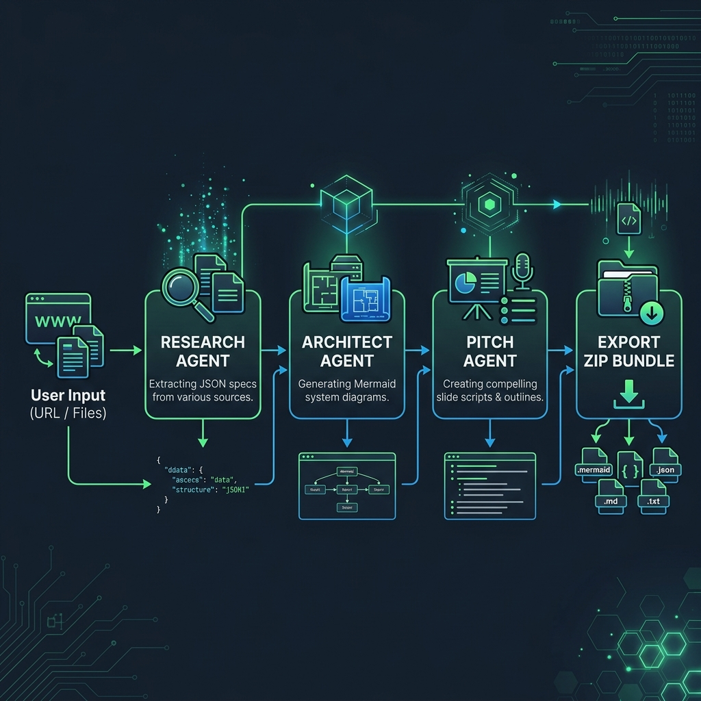

# Innovator's Co-Pilot 🚀

> **Drop a problem. Ship a solution.** A high-velocity multi-agent concierge system for hackathons.

Innovator's Co-Pilot is a Next.js web application designed to help hackathon teams and product builders move from a raw idea or problem statement to a structured product blueprint in seconds. By coordinating multiple specialized AI agents, it analyzes specifications, architects systems, drafts presentation decks, and exports a production-ready package.

---

## 🛠️ Multi-Agent Workflow

Here is how the Innovator's Co-Pilot pipeline works:



1. **Input Stage**: The user enters a project URL or uploads a specification file (e.g., project outline, PDFs, or grid specs).
2. **Research Agent**: Analyzes the input to extract structured intelligence, user requirements, tech stack preferences, and core specifications, outputting a clean JSON summary.
3. **Architect Agent**: Formulates the technical architecture and generates a live, interactive system architecture diagram using Mermaid.js syntax.
4. **Pitch Agent**: Automatically prepares an 8-slide presentation script with titles, content points, slide durations, and stage directions.
5. **One-Click Bundler**: Compiles the JSON intelligence, Mermaid file, pitch script, and a high-resolution 2x rasterized PNG of the architecture diagram into a ZIP file.

---

## 🌟 Key Features

* **Sequential Pipeline Simulation**: Watch the Research, Architect, and Pitch agents stream their output in real time.
* **Interactive Panel Expanding**: Click on any of the output panels (JSON, Architecture Diagram, Pitch Script) to focus on it.
* **Dynamic Mermaid rendering**: System architecture diagrams render dynamically in the browser.
* **High-Resolution Exporter**: Uses the Canvas API to capture the SVG diagram, apply custom theme styling, and rasterize it to a 2x resolution PNG for the bundle.
* **Ready-to-Use Mock Templates**: Quick-select buttons for common hackathon themes like smart microgrids, document compliance query agents, or code copilots.

---

## 💻 Technical Stack

* **Framework**: Next.js 15 (React 19 / TypeScript)
* **Styling**: Tailwind CSS
* **Graphics**: Mermaid.js & HTML5 Canvas API
* **Zip Compression**: JSZip

---

## 🚀 Getting Started

First, install the dependencies:

```bash
npm install
```

Then, run the development server:

```bash
npm run dev
```

Open [http://localhost:3000](http://localhost:3000) with your browser to see the result.

You can start editing the page by modifying `src/app/page.tsx`.
